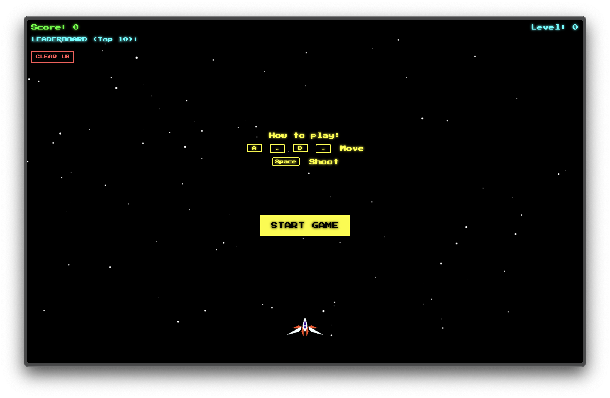
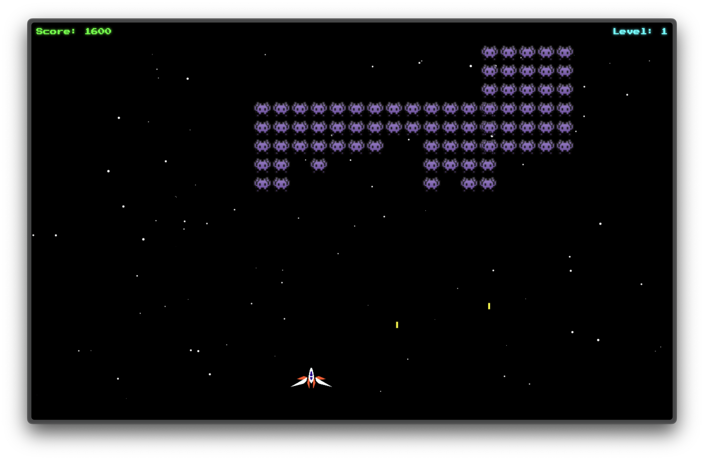
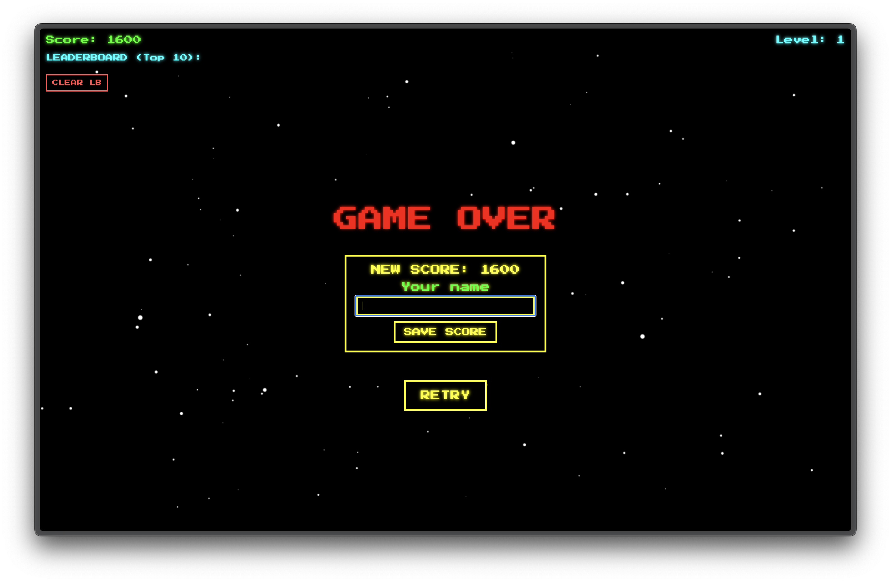

# Space Invaders

A fully playable Space Invaders–style game built from scratch with HTML5 Canvas + Vanilla JavaScript, featuring levels, power-ups, audio effects, and a persistent leaderboard.

## Features

- Smooth Player Controls – Responsive left/right movement & shooting
- Invader AI – Bouncing, descending grids that shoot back
- Dynamic Background – Parallax starfield particles for retro atmosphere
- Explosions & Effects – Particles, tilts, and animated impacts
- Scoring & Levels – Points increase with level difficulty
- Power-Ups – Shields & bonus points with timed effects
- Leaderboard – Persistent top 10 high scores via LocalStorage
- Immersive Audio – Background music + laser & explosion SFX
- Responsive 16:9 Scaling – Consistent experience on any screen

## Controls

- **A** or **←**: move left
- **D** or **→**: move right
- **Space**: shoot

💡 Tip: Power-ups spawn occasionally—grab them for shields or bonus points!

## Screenshots







## Levels

The game now features multiple levels.

Each new level increases:

- Invader movement speed
- Invader projectile speed
- Spawn frequency of invader grids

“Next Level” message and sound play when you clear all invaders.

Progress is tracked on-screen via the Level display.

## Audio

The game includes immersive audio effects:

- Background music that loops during gameplay
- Laser sound effects for shooting
- Explosion sounds for enemy destruction

## Leaderboard

- Automatically tracks your top 10 scores
- Enter your name when you achieve a high score
- Persistent storage - scores are saved between browser sessions
- Clear leaderboard option available

## Getting Started

1. Clone the repo.

```bash
git clone https://github.com/manursutil/space-invaders.git
cd space-invaders
```

The folder structure should look like this:

```bash
.
├─ index.html
├─ styles.css
├─ main.js
├─ audio/
│  ├─ bgMusic.mp3
│  ├─ laser.mp3
│  ├─ explosion.mp3
│  └─ victory.mp3
└─ img/
   ├─ spaceship.png
   └─ invader.png
```

2. Serve locally using one of these methods:
   - `npx serve .` (requires Node.js)
   - Use Live Server extension in VS Code
   - Open `index.html` directly in browser (file://)

## Tech Stack

- HTML5 Canvas – Rendering & animations
- Vanilla JavaScript – Game logic & mechanics
- CSS3 – UI styling & animations
- LocalStorage – Persistent leaderboard

## Technical Notes

- Built with vanilla HTML5 Canvas and JavaScript
- Uses CSS animations for UI effects
- Local storage for persistent leaderboard data
- Responsive 16:9 aspect ratio scaling
